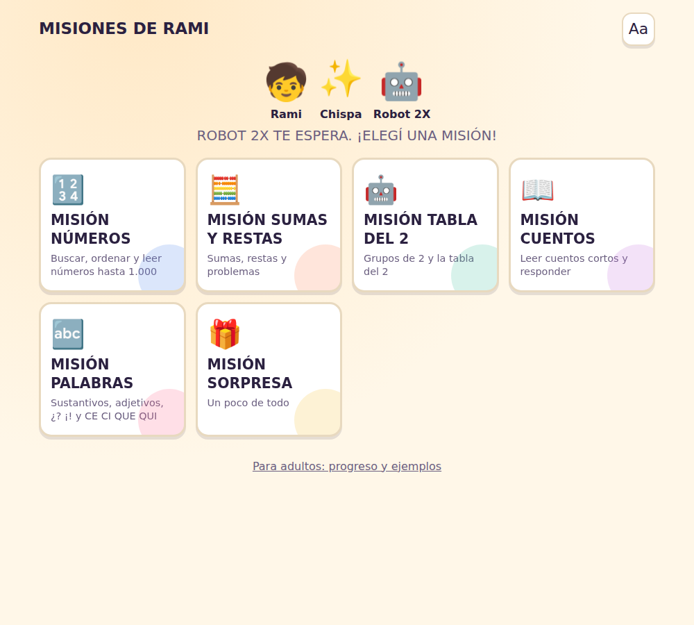

# Misiones de Rami — motor de actividades para 2.º grado

Juego en una sola página (`index.html` + `motor.js` + `app.js`, sin dependencias) con un **motor que genera actividades nuevas cada vez** a partir de bancos de datos verificados, plantillas, variables y reglas. No hay un banco estático de preguntas: el niño puede jugar muchas sesiones sin encontrarse con la misma pregunta.

Abrí `index.html` en el navegador. Hay seis misiones (Números, Sumas y Restas, Tabla del 2, Cuentos, Palabras y Sorpresa) de 8 actividades cada una, más un panel **Para adultos** con el progreso por tema y una vista previa del generador.



## Cómo funciona el motor (`motor.js`)

| Requisito | Dónde está |
|---|---|
| Semilla pseudoaleatoria por sesión | `crearAzar` (mulberry32) con semilla nueva en cada `crearMotor()`; las últimas semillas quedan guardadas |
| Números por nivel (1: 1–100, 2: 100–500, 3: 500–1000) | `RANGOS`, `generateNumber`, `generateDifferentNumber`, `generateNumberWithConstraints` |
| Numeración (tipos A–I) | `NUMERACION`: buscar, después, antes, mayor, menor, ordenar ↑ y ↓, qué número falta (de 1 en 1 o de 10 en 10), número entre dos |
| Números en letras hasta 1.000 | `numeroEnLetras` (probado del 1 al 1000). Distractores plausibles: cifras cambiadas de lugar (572 → 527, 752) o una decena/centena de diferencia |
| Sumas y restas | Nivel 1 sin llevar/sin pedir, nivel 2 llevando/pidiendo, nivel 3 con centenas o problemas. Representaciones: cuenta, objetos (🍎🍎 + 🍎), barras de 10 y cubitos, problema, escuchar el problema, unir cuentas, tocar las cuentas que dan N, estimar «más o menos que 50». Las restas nunca dan negativo |
| Problemas | `PERSONAJES` × `OBJETOS` × acciones. Cada objeto tiene solo las acciones que tienen sentido con él y la acción decide la operación, así la historia siempre coincide con la cuenta |
| Tabla del 2 | `TABLA2`: grupos de 2, 2 filas de n, suma repetida (4 + 4, 2 + 2 + 2), cuenta, secuencia con hueco en cualquier lugar, factor que falta, problemas con pares (bicicletas y ruedas…), unir, escuchar, tocar resultados y ordenar saltos. Cada misión usa un orden de 1 a 10 distinto al de la sesión anterior |
| Cuentos | `crearCuento`: personaje + lugar + recipiente de color + evento + hallazgo (+ «primero…» en nivel 2 y «porque…» en nivel 3). Preguntas solo sobre datos del texto: quién, dónde, color, qué encontró, qué había, qué hizo primero, por qué, qué hizo después, verdadero/falso, completar, ordenar sucesos y escuchar el cuento |
| Sustantivos, adjetivos y frases | Cada sustantivo trae sus adjetivos y verbos posibles (concordancia de género incluida) y una lista de verbos que seguro no le corresponden, para que los distractores nunca sean ambiguos |
| ¿? y ¡! | Plantillas de preguntas y exclamaciones con variables y situaciones («Rami quiere saber dónde está la llave. ¿Qué dice?»). Las frases que podrían ser las dos cosas («Cuántas estrellas hay») no se usan sin signos |
| CE / CI / QUE / QUI | `PALABRAS_CQ`: solo palabras verificadas. El hueco siempre va acompañado de un dibujo o del audio que definen la palabra; «quince» (tiene QUI y CE) no se usa para clasificar; los errores de ortografía que coinciden con palabras reales (quena, kine…) nunca son distractores |
| Opciones y posición de la respuesta | Se mezclan siempre y la correcta nunca cae dos veces seguidas en el mismo lugar |
| Anti-repetición | `similitud()` / `isTooSimilar()` compara tipo, números, texto, respuesta, opciones, estructura y rasgos (personaje, objeto, lugar, palabra). Si la actividad se parece a una de las últimas 30, se descarta y se genera otra (hasta 40 intentos) |
| Dificultad adaptativa | Por tema: 3 aciertos seguidos sin pistas suben un nivel; 2 errores o actividades con 2+ pistas bajan uno; acertar con una pista mantiene. Nunca se usa la velocidad |
| Repaso sin repetición mecánica | Si falla 2 × 4, siguen ⭐ «4 grupos de 2», «4 + 4» y recién después «2 × 4» con otra consigna. En los demás temas, otra actividad del mismo concepto con otra representación. El repaso pendiente queda guardado para la próxima sesión |
| Variedad de interacción | Cada misión recorre tocar → elegir → ordenar → completar → asociar → arrastrar → escuchar |
| Historial | `localStorage` con prefijo `aventura2.`: `recentActivities`, `correctAnswers`, `wrongAnswers`, `usedHints`, `topicsPracticed`, `difficultyLevel` (y `motorInterno` para rachas, posiciones, orden de la tabla y repasos). Si el navegador no permite guardar, el juego funciona igual en memoria |

API principal:

```js
const motor = Motor.crearMotor();          // semilla nueva, lee el historial
const m = motor.nuevaMision('tabla');      // numeros | calculos | tabla | cuentos | palabras | sorpresa
const act = motor.siguienteActividad(m);   // null cuando terminó
Motor.comprobar(act, respuesta);           // true / false
motor.registrarResultado(m, act, { correcto, pistas });
motor.generarActividad('suma', { nivel: 2 }); // una actividad suelta
```

## Pruebas

```sh
node aventura/pruebas/probar-motor.js                              # ~19.000 actividades revisadas
NODE_PATH="$(npm root -g)" node aventura/herramientas/jugar.js     # juega todas las misiones en Chromium
```

`probar-motor.js` genera 120 actividades por modalidad y nivel y verifica que cada cuenta dé exactamente la respuesta, que los números respeten el nivel, que los huecos formen palabras del banco, que no haya dos respuestas posibles, que la respuesta de comprensión esté en el cuento, que no se repita ninguna de las 30 anteriores, que tres «días» distintos den actividades distintas, que la dificultad suba y baje como corresponde y que el repaso de 2 × 4 siga la cadena grupos → suma → cuenta. `SEMILLA=123 node …` repite todo con otras semillas.

`jugar.js` recorre las misiones respondiendo bien y a veces mal, controla errores de consola y desbordes en pantalla de computadora y de celular, y guarda capturas en `capturas/`.
