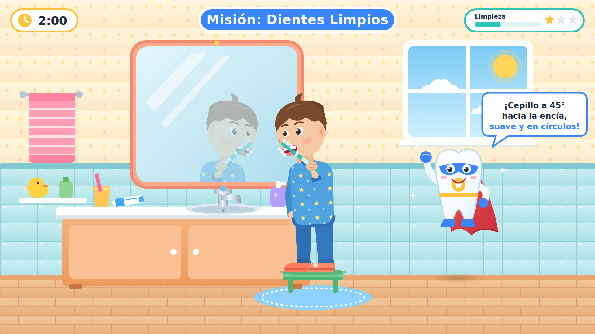

# Misión: Dientes Limpios — escena base para animación

Escena 2D (1920×1080) de un videojuego educativo infantil: un niño de ~6 años se cepilla los dientes frente al espejo, acompañado por **Superdiente**.



## Archivos

| Archivo | Qué es |
|---|---|
| `mision-dientes-limpios.svg` | **Archivo maestro** en vectores, organizado en capas con nombre para animar |
| `animacion.js` | Ciclo de animación de referencia (`posar(svg, t)`), determinista |
| `vista-previa.html` | Escena animada: se abre en el navegador (se genera con el exportador) |
| `export/escena-base.png` | Pose de reposo en PNG |
| `export/cepillado/f01–f08.png` | Un ciclo completo de cepillado (0,5 s, 8 fotogramas = 16 fps) |
| `export/cepillado-sprites.png` | Hoja de sprites del niño con los 8 fotogramas |
| `herramientas/exportar.js` | Vuelve a generar la vista previa y los PNG a partir del SVG |

Para regenerar: `cd escena && NODE_PATH="$(npm root -g)" node herramientas/exportar.js` (requiere Playwright).

## Pose del niño (pensada para animar)

- Cuerpo completo, de pie sobre un taburete, **pies separados al ancho de los hombros**.
- Tronco erguido e inclinado 3° hacia el espejo desde la cadera; cabeza inclinada 5° más, cara mirando al espejo.
- **Brazo del cepillo flexionado**, codo pegado al cuerpo, antebrazo dirigido a la boca, muñeca relajada.
- El cepillo entra en la boca entreabierta; las cerdas tocan los dientes, **inclinadas unos 45° respecto de la encía**. La espuma se dibuja por encima del cabezal para que parezca que está dentro de la boca.
- El otro brazo cuelga relajado junto al cuerpo, sin molestar.
- El espejo muestra un reflejo real: un `<use>` simétrico del tren superior, así que cualquier animación del niño se refleja sola.

## Capas y pivotes

Cada grupo que gira tiene `data-pivot="x,y"` y **no lleva transformación en la pose de reposo** (salvo la inclinación de tronco y cabeza, que ya parte del pivote). Así se anima con `rotate(ángulo, x, y)` sin recalcular nada.

```
#nino
  #nino-pierna-lejana / #nino-pierna-cercana   fijas (pies apoyados)
  #nino-superior        pivote cadera 1012,712
    #nino-brazo-lejano  pivote hombro 958,550
    #nino-torso, #nino-cuello
    #nino-cabeza        pivote cuello 1004,508
      #nino-ojos        parpadeo (scaleY sobre 966,420)
      #nino-boca
    #nino-brazo-cercano pivote hombro 1050,552
      #nino-antebrazo   pivote codo 1044,638
        #nino-mano-cepillo  pivote puño 1015,536
          #cepillo  (#cepillo-cerdas)
          #nino-mano
    #nino-espuma
#superdiente            flota (translate)
  #sd-capa (pivote 0,-40) · #sd-brazo-arriba (-62,-10) · #sd-brazo-cintura (62,0) · #sd-ojos · #sd-destellos
#ui                     título, tiempo, barra de limpieza y consejo (se puede ocultar entera)
```

## Ciclo de cepillado de referencia

- 2 pasadas por segundo: el puño (`#nino-mano-cepillo`) traza una elipse de 4×2,5 px a lo largo de la encía, es decir, **círculos pequeños y suaves**.
- El antebrazo acompaña con ±1,6° sobre el codo y el hombro con ±0,7°, algo desfasados, para que el gesto se vea natural.
- La cabeza oscila ±0,5°, el tronco "respira" y los ojos parpadean cada ~3,4 s.
- Superdiente flota, saluda con el puño, mueve la capa y parpadea.
