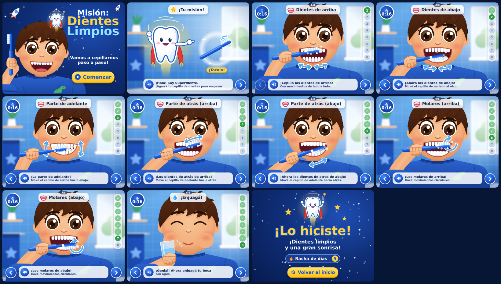

# Misión: Dientes Limpios — juego paso a paso

Juego educativo infantil en una sola página (`index.html`, sin dependencias): primer plano frontal del niño en un baño azul desenfocado y 8 pasos guiados de cepillado.

El estilo sigue el video de referencia: formato 4:3, piel cálida, pelo castaño oscuro, ojos grandes con pestañas marcadas, puño grande sobre el cepillo, flechas curvas bajo el mentón, parpadeo e interfaz de vidrio esmerilado. `capturas/demo-paso2.mp4` muestra 5 s del paso 2 en movimiento.

## Flujo
1. **Inicio**: título, «¡Vamos a cepillarnos paso a paso!» y botón **Comenzar**.
1. **Tu misión**: Superdiente (muela con capa roja, aura dorada y haz de luz) saluda y pide «¡Agarrá tu cepillo de dientes para empezar!». Al tocar el cepillo (o la flecha), vuela hacia la mano del niño y empieza el paso 1.
2. **8 pasos de 20 s** cada uno: dientes de arriba, de abajo, parte de adelante, parte de atrás (arriba y abajo), molares (arriba y abajo) y enjuague.
   - Reloj circular, píldora «n/8» con el nombre del paso, lista vertical de progreso y flechas ‹ ›.
   - Consigna con botón de altavoz: se lee en voz alta (voz del navegador, `es-AR`).
   - El cepillo se mueve como indica el paso (lado a lado, arriba-abajo, adelante-atrás o en círculos) y hay flechas guía que laten.
   - Manchitas de sarro que se van limpiando mientras corre el reloj; al terminar, «¡Muy bien!» con destellos y avance automático.
3. **Final**: «¡Lo hiciste!», racha de días (guardada en el navegador) y **Volver al inicio**.

## Para animadores
Todo el dibujo es SVG generado por código: el brazo se recalcula en cada fotograma para seguir la mano, así que basta con mover el cepillo (`colocarProp`). Las posiciones y los movimientos de cada paso están en la tabla `PASOS`.

Capturas: `cd juego && NODE_PATH="$(npm root -g)" node herramientas/capturas.js`
